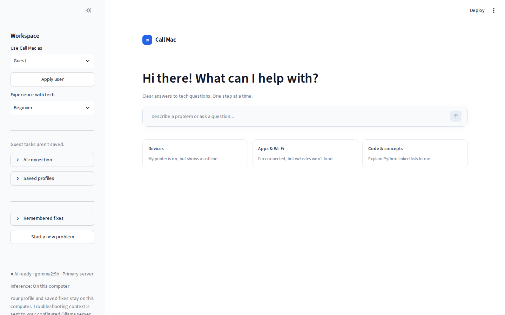
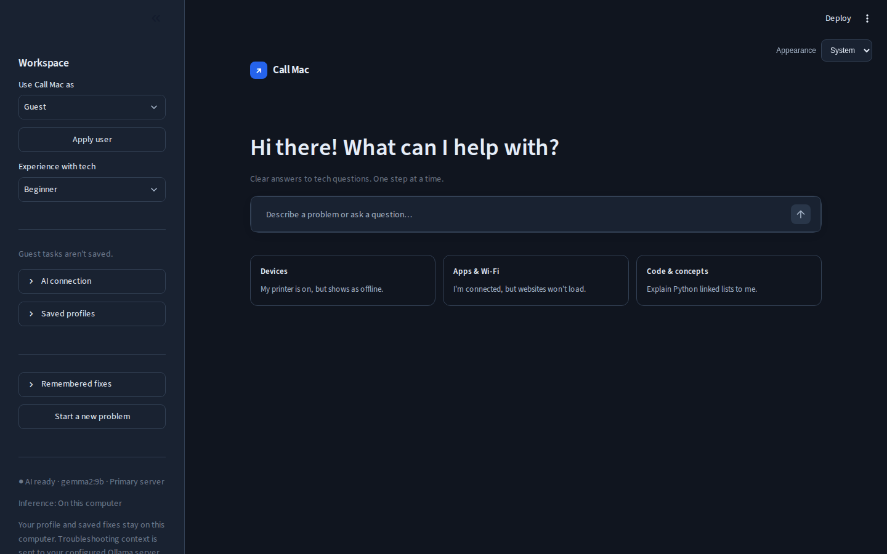
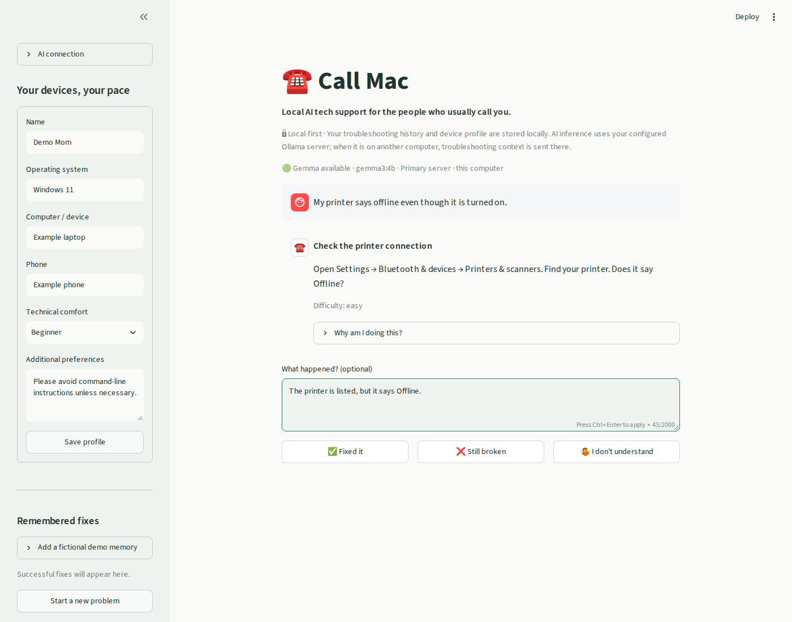
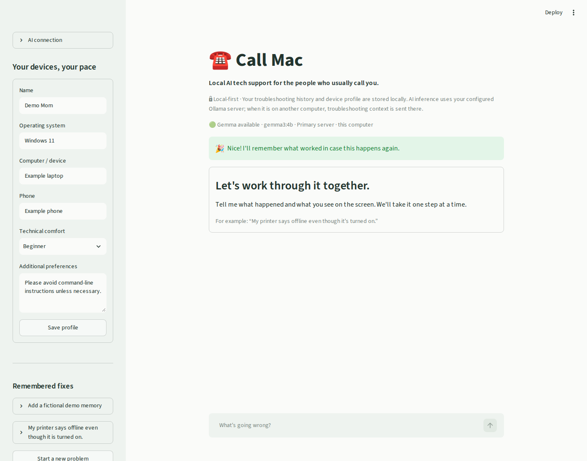

# ☎️ Call Mac

**Local AI tech support for the people who usually call you.**

Everyone in my family has a free tech-support subscription.

Unfortunately, the subscription is me.

Call Mac is a local troubleshooting assistant for the people who normally call
or text a friend when technology stops working. It remembers their devices,
technical comfort, and what fixed earlier problems. Instead of a wall of advice,
it offers one step and waits to hear what happened.

An open-weight Gemma model runs through Ollama on your computer or a configured server. The profile, attempts,
and successful fixes stay in SQLite on the user's computer.

Read the [DEV challenge writeup: Call Mac — Patient AI Tech Support for My Mom](https://dev.to/mackenzie-techdocs/call-mac-patient-ai-tech-support-for-my-mom-2ccm)
for the story behind the project and why open-weight AI matters.

## The problem and who it's for

A printer that says “offline” can interrupt someone's whole day. General chatbots
often assume technical knowledge, offer too many fixes at once, and forget what
worked last time. Call Mac is built for one person at a time, especially someone
who needs patient, explicit instructions about where to click.

## How it works

1. Stay as **Guest** and choose your experience in the sidebar, or create a saved
   profile in the sidebar and select it in the sidebar under **Use Call Mac as → Apply user**.
2. Describe the problem naturally.
3. Get one troubleshooting action with an expandable explanation and visible warnings.
4. Choose **Fixed it**, **Still broken**, or **I don't understand**.
5. Add optional observations in **What happened?** before choosing feedback.
   Failed actions and observations go into the next prompt. The assistant can explain
   the current action, ask for context, or change a blocked approach.
   A confirmed fix becomes local memory for future problems.

The latest active problem resumes after a restart. A prominent **New help task**
button above the conversation opens a fresh input immediately. Starting a new problem pauses
the old one. This MVP has no session browser. Related successful fixes are ranked by keyword overlap and passed
to Gemma as experiences, never guarantees. Unrelated fixes are excluded.

## Architecture

```text
Streamlit UI (app.py)
    ├── Profile, sessions, attempts, fixes → SQLite (database.py)
    └── Prompt construction (prompts.py)
          → Configured Ollama HTTP API (agent.py)
          → Gemma → Pydantic validation (models.py)
```

There are no embeddings, agent frameworks, cloud databases, analytics, accounts,
or external AI APIs. Each SQLite operation has its own connection and transaction.
Confirming a fix updates the attempt, session, and solution together. Feedback is
saved before inference, so failed requests can be retried without losing progress.

## Open innovation is a product feature

Tech support can involve filenames, device details, Wi-Fi information,
troubleshooting history, and sensitive information visible in screenshots.
That information does not inherently need to go to a hosted LLM provider.
Open-weight AI makes local inference possible and allows the model to be replaced
or upgraded without redesigning the application.

Call Mac's MVP accepts text only; screenshot input is future work.

### Why Gemma?

[Gemma 3](https://ollama.com/library/gemma3) provides instruction-tuned open weights
in several sizes. The default is `gemma3:4b`, a practical starting point for consumer
hardware. Its download is approximately 3.3 GB; inference needs additional memory.
Speed depends on your machine. `gemma3:1b` is a smaller text-only alternative with a
quality tradeoff. Review the [Gemma terms](https://ai.google.dev/gemma/terms).

Responses use Ollama's [structured output schema support](https://ollama.com/blog/structured-outputs)
and are validated again with Pydantic. If an Ollama-compatible server rejects
the schema grammar, Call Mac retries in JSON mode with the same validation. Invalid output or an exact repeated failed
instruction gets one retry, then a friendly error.

## Privacy and local-first design

- Profile and history live in `data/call_mac.db`, excluded from Git.
- Ollama uses loopback by default. Servers explicitly configured in `.env` may
  run on another computer; profile, problem, history, and remembered fixes are sent
  to that server. Redirects and environment proxies are disabled.
- Streamlit listens on `127.0.0.1`; usage telemetry is disabled in project config.
- Installing dependencies and downloading weights require the internet. Inference
  and memory do not require a hosted service.
- SQLite is not encrypted. Anyone who can read your files may read it. Avoid
  passwords or secrets, and back up the database if you want to preserve fixes.

## Help inside the app

Choose **Help** beside **Appearance** at the top right of Call Mac for first-time setup, usage instructions,
and technical reference docs. Choose **Back to conversation** to return to your conversation.
The Help page reads the files in `docs/`, so the guides stay in sync.

## Start here: first-time setup

**New to this? Follow the [first-time guide](docs/getting-started.md).** It walks
through downloading Call Mac, installing Python and Ollama, opening a terminal,
and getting your first answer on Windows, macOS, or Linux.

For Ollama on **this computer**, you do not need an account, API key, server
address, or `.env` file. Call Mac automatically connects to
`http://127.0.0.1:11434` — “this computer.” The address is `127.0.0.1`, not
`127.0.0.01`. Keep Ollama open while you use Call Mac.

### Quick setup for experienced users

Install Python **3.11 or newer** and [Ollama](https://ollama.com/download), open
Ollama, then run these commands from the extracted repository folder:

```bash
python3 -m venv .venv
.venv/bin/python -m pip install -r requirements.txt
ollama pull gemma3:4b
.venv/bin/python -m streamlit run app.py
```

On Windows PowerShell, use:

```powershell
py -3 -m venv .venv
.\.venv\Scripts\python.exe -m pip install -r requirements.txt
ollama pull gemma3:4b
.\.venv\Scripts\python.exe -m streamlit run app.py
```

On Linux, start `ollama serve` in another terminal if Ollama is not running.
Open **http://localhost:8501** if the browser does not open automatically. In the
sidebar, expand **AI connection** and click **Test connection**. You can start
as Guest; a saved profile is optional.

Next time, open Ollama and run only the final Streamlit command from your project
folder. Leave that terminal open; **Ctrl+C** stops Call Mac.

### Configuration (optional)

Skip this section when Ollama runs on this computer. To change settings, copy
[`.env.example`](.env.example) to a file named `.env` in the **same folder as
`app.py`**, then edit that copy in a text editor. See the
[configuration walkthrough](docs/getting-started.md#optional-use-a-different-ollama-server).


| Variable | Default | Purpose |
| --- | --- | --- |
| `CALL_MAC_MODEL` | `gemma3:4b` | Model name; pull the same model first |
| `CALL_MAC_OLLAMA_URL` | `OLLAMA_BASE_URL` or `http://127.0.0.1:11434` | Primary endpoint override |
| `OLLAMA_BASE_URL` | Loopback default | Primary Ollama server, loaded from `.env` |
| `OLLAMA_SECONDARY_URL` | Unset | Fallback server, loaded from `.env` |
| `CALL_MAC_DB` | `<repository>/data/call_mac.db` | SQLite file location |

The repository `.env` is loaded automatically; existing process variables take precedence.
Call Mac tries the primary server, then the secondary if it is unreachable or lacks
the selected model. The last working server is preferred for subsequent requests.
Restart Streamlit after editing `.env`. Install the selected weights on the servers.

For a smaller model:

```bash
ollama pull gemma3:1b
CALL_MAC_MODEL=gemma3:1b python -m streamlit run app.py
```

## Demo walkthrough

[Watch the Call Mac video demo on YouTube](https://youtu.be/4DAJSamZxpw).

### Public browser demo

[Try Call Mac in your browser](https://mso-docs.github.io/Call-Mac/).

The standalone [`demo/`](demo/) site can be hosted on **GitHub Pages or Vercel**.
Visitors can connect their own Ollama directly from the browser or try a labeled,
fictional sample without installing anything. Conversations stay in the open tab;
this version has no saved profiles or remembered fixes. Visitors need to allow the
site's origin in Ollama and may need to grant browser local-network permission.

See [browser demo setup and deployment](docs/browser-demo.md) for publishing,
Ollama configuration, local preview, and privacy details. The included Pages
workflow publishes only the demo directory. No hosting API key or `.env` is needed.

### Local app walkthrough

1. Set the profile to Mom, Windows 11, HP laptop, Samsung Galaxy, Beginner.
2. Expand **Demo tools** and click **Add demo printer fix**.
   Seeding is optional and idempotent. The example is labeled fictional.
3. Enter “My printer says offline even though it's turned on.”
4. Click **Still broken**, then **I don't understand**, then **Fixed it**.
5. Check the new remembered fix in the sidebar.
6. Start a related problem: recent memory is included in Gemma's context.
7. Restart Streamlit to verify profile and memory persistence.
8. Stop Ollama to see the friendly error and setup guidance.

### Interface

The interface uses a white background, slate text, blue accents, and compact
conversation cards. The welcome screen places the input beside a single greeting
and three small examples. The sidebar holds user selection, experience, remembered
fixes, and collapsible profile and AI settings. The main area focuses on describing
a problem and following one step at a time. On small screens, open the sidebar to
switch users or edit settings.

Use **Appearance** in the top-right corner to choose **System**, **Light**, or
**Dark**. System is the default and follows the browser/OS color preference,
including changes while the app is open. An explicit choice is remembered in
this browser across refreshes using local storage; no account is needed.

### Screenshots

The welcome screenshot shows the current interface. Conversation screenshots
show earlier styling, with a fictional profile and controlled demo responses.






## Checks

```bash
python -m unittest discover -s tests -v
python -m compileall -q app.py agent.py database.py models.py prompts.py
```

Tests use temporary SQLite files and controlled model responses, including a
Streamlit AppTest walkthrough. They do not download weights or prove model quality.
Complete the walkthrough with real Gemma before presenting.

## Limitations

- AI can give incorrect advice. Prompts encourage safe actions but cannot guarantee
  them. Schema validation verifies structure, not correctness or safety.
- Exact and near-identical failed steps and explanations are rejected. If clarification
  still repeats after a retry, Call Mac asks what screen and options the user sees.
  Semantic paraphrases and changes of action still cannot be reliably detected.
- Text input and multiple local profiles. Memory uses simple keyword matching, not semantic retrieval.
- Long histories may exceed smaller models' context windows. CPU inference can be
  slow; requests have a 180-second read timeout.
- The app cannot inspect devices or verify success. Only **Fixed it** stores success.
- Actual hardware/model validation requires Ollama and the chosen weights.

## Future work

After validating the MVP with real Gemma: screenshot input and history export.
The Streamlit app is intended for local use; the separate browser demo uses
tab-local state and direct requests to the visitor's Ollama.


## Demo readiness and private configuration

Server addresses belong only in the ignored `.env` file or process environment.
`.env.*` files are also ignored, except the public `.env.example` template. No real server addresses belong in screenshots,
README examples, fixtures, or SQLite. Connection controls show only Primary or
Secondary labels. The repository provides no private server configuration.

Connection testing verifies reachability and installed weights, not generation
speed. Inference failures distinguish connection timeouts from a model that is
loading or busy. Use the demo walkthrough to validate actual advice and latency.

See [demo validation](docs/demo-validation.md) for the checks and limitations.


### Context questions and blocked actions

One model call produces a structured decision: what is known, what information is
missing, and whether to ask, instruct, explain, change approach, or refer. Questions
use **Send reply**. Only explicit explanations reuse an action identity; a blocked
path can be abandoned. Python validates the contract rather than deciding ordinary
conversation routes with keyword rules. Advice quality still depends on the model.

Compare models with fictional scenarios:

```bash
python evals/run.py --model gemma2:2b
python evals/run.py --model gemma2:9b
```

These checks validate response structure and allowed next moves. Review the actual
advice too: a passing move check is not proof of contextual or safety correctness.


### Liquid-damage safety routing

Reported liquid exposure takes priority over ordinary troubleshooting and bypasses
model generation. Call Mac advises keeping the device unpowered and refers submerged
devices for professional assessment. Follow-up replies cannot route back to charging
or power-on tests. The rules cover common phrasing, not every possible hazard; they
are not a substitute for a technician. See [Apple liquid guidance](https://support.apple.com/en-us/120854).

### Response style

Replies aim for a short, friendly assessment followed by one practical next action.
A few small substeps or a ready-to-say repair-shop script are welcome; jargon, long
lectures, and generic advice are not. Deeper explanation stays under the expandable
why section. Prognoses acknowledge uncertainty instead of promising recovery.


### Guests and saved users

The app starts in Guest mode with a general greeting. Set **Experience with tech**
in the sidebar: Beginner, Comfortable, or Technical. Guest tasks live only in the current
browser session; no guest profile, troubleshooting history, or fixes are stored in
SQLite. Closing or losing the browser session can discard a guest task.

In **Saved profiles**, create or edit a profile and click **Save profile**. Saving
also applies it. To use an existing profile, select it in the sidebar and click **Apply
user**. Named users get a personal greeting; prompts receive that user's devices,
preferences, and current experience level. Each saved user has separate tasks and
fixes. Applying Guest hides saved-user history and uses no saved memories.

The sidebar experience control is a session override. Save the technical comfort in
the profile editor to make it permanent. Profile switching is a local convenience,
not authentication: anyone using the app can select any saved profile.


### Programming and technology questions

Call Mac covers programming, debugging, software, hardware, networking, and
technology explanations as well as troubleshooting. Informational requests use
an `answer` decision, with code examples when useful, and a follow-up box instead
of fix/failure feedback. Answers are stored as conversation history for saved users
but never as successful fixes. Unrelated requests get a technology help menu.
Scope is decided by the model, not a keyword classifier. Code can still be incorrect;
review examples before using them. The app does not execute generated code.

Responses now show a brief **assessment** above the next step. Essential context
is visible; deeper explanation remains expandable. New model replies without an
assessment are retried. Existing histories remain readable. Beginner-only terminal
explanations are hidden for Comfortable and Technical users.
